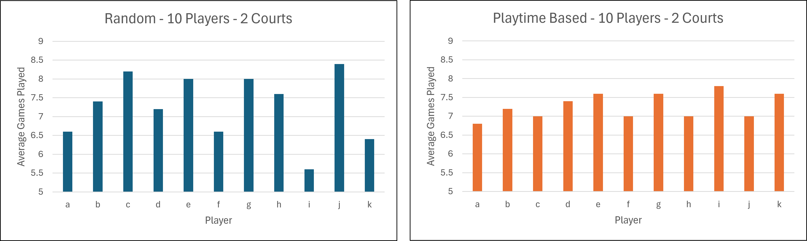
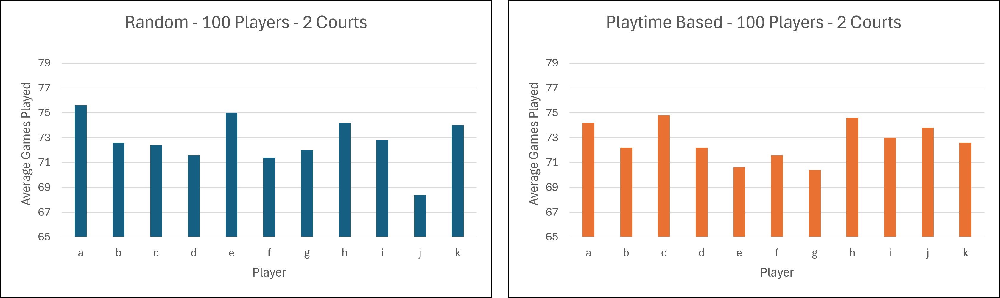
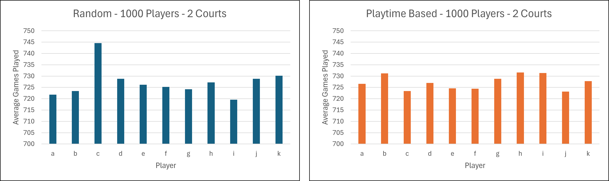

## Introduction

This repo contains an experiment in generating `Sessions` of `Games` for multiplayer sports.

- A `Session` is defined as a series of concurrent `Games`
  - e.g. if multiple courts are used for several Game instances at once
- A `Game` is defined as a single courts state of play. Containing each `Pair` of players
- A `Pair` is defined as the names of the players on each team

_Note_: All `Session`, `Game` and `Pair` objects have a `key` value, which is defined as the composite parts, sorted alphabetically, and separated by a marker which varies by type.
This is used to de-duplicate the list, but also to avoid set ups where matches containing `Player A + Player B` exists alongside ones containing `Player B + Player A`.

## The Problem

The algorithm currently used to work out team compositions for matches is not random enough.
Although it functions correctly, and produced unique games, which share roughly evenly between all players; it has a flaw where games follow a pattern.
This pattern is rotating players in a circle on the same courts until all those combinations are used, before players are mixed between courts.

The algorithms in this repo aim to address this by randomising the matches more, whilst maintaining the rules of not duplicating players and keeping number of matches played roughly even.

## Calculation Methodologies

There are two solutions explored in this repo.

- Calculating every possible game combination for the given players, deduplicating and randomly selecting non-conflicting matches.

- Calculating every possible game combination for the given players, deduplicating and using a playtime sorted list to select players which should play, before randomly selecting a game which includes all players.

Each is expanded further below.

### Random Game Selection

Firstly, all possible game combinations must be generated.

#### Generation of Possible Games

The generation of all possible games is common to both methods but will only be outlined once.

The following steps are taken to generate all possible combinations:

- Looping through all players

  - Loop through all players to the right in the array
    - Create a `Pair` containing the player names with a `key` of the structure `a-b` (sorted alphabetically)

- Looping through all `Pair`

  - Loop through all `Pair` to the right in the array
  - Check both `Pair` contains unique players
    - I.e. `a-b` and `a-c` is rejected
  - Generate the `key` of the new potential `Game` with the structure `a-b vs c-d` (where pairs are sorted alphabetically)
  - If `key` is not within the map of games, add it to the map

- Looping through all `Game`

  - Loop through all `Game` to the right in the array
  - Check both `Game` contains unique `key`
    - I.e. `a-b vs c-d` and `a-e vs f-g` is rejected
  - Generate the `key` of the new potential `Session` with the structure `a-b vs c-d - d-e vs f-g` (where games are sorted alphabetically)
  - If `key` is not within the map of sessions, add it to the map

- Return array of potential game `Session`

_Note_: Only items to the right are checked in the arrays as combinations are sorted and treated as equal.
Meaning the `Pair` `A-D` is treated as a duplicate of `D-A`, as such the pair is not generated at all.

#### Generating Session List

Once all possible games are known, the list is shuffled using the Durstenfeld shuffle algorithm.
This is necessary due to how the games are generated in sequence, resulting in a alphabetised list.

Once the list has been shuffled, the first `X` games are returned to the caller. Where `X` is the number of requested games.
Each returned `Session` contains 1 to many sets of `Game`, equal to the number of courts requested.

### Playtime Based Selection

Upon initial testing of the random method detailed above, it was quickly identified that there can be large disparates in the number of matches a particular player is in.
Introducing `playtime` as a metric helps avoid this situation.

`Playtime` has been defined at the number of matches which a particular player is a part of.
Incrementing by one every time they are in a match.

By sorting this list based on `playtime`, in a descending numerical order, gives a priority list of sorts for the next Session.
This list is then used to filter down the list of all possible games and select the session to be used.
Further detail of operation is laid out below:

- Calculate all possible games

- Calculate all players `playtime`

- Sort players from least to most `playtime`

- Take a slice of all players, limited to the number of courts multiplied by four (total active players per Session)

  - This list is shuffled after generation to help avoid the players not in active games always being matched together

- Take the first four players in this array and filter the possible games to only ones containing all four players

- Pick a random game from this list and add it to the generated `Session`

- If needed, repeat until all courts full

- Return generated `Session`

## Results

After creating both algorithms, some crude benchmarks were carried out.
Each method was used to generate 10, 100, and 1000 games, which was repeated 5 times.
The results can be seen below.

The scales of all graphs have been fixed to the same values.
Although not obvious from the graphs, the playtime based calculations have reduced variance when compared to the random approach.
Being reduced by 14.6%, 58.0% and 23.4% respectfully.
